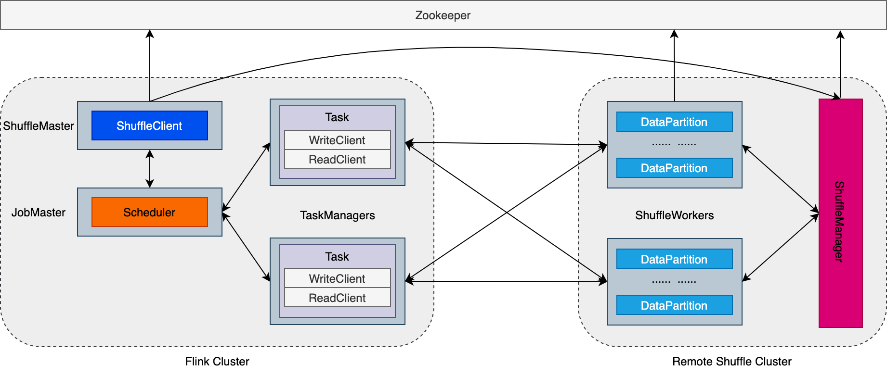
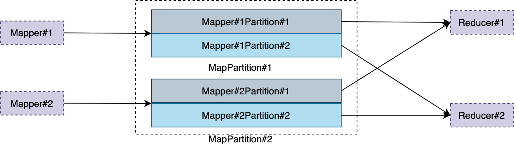
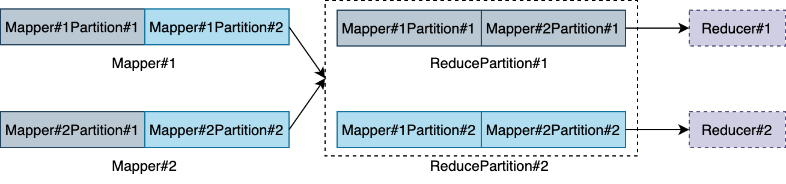

<!--
 Copyright 2021 The Flink Remote Shuffle Project

 Licensed under the Apache License, Version 2.0 (the "License");
 you may not use this file except in compliance with the License.
 You may obtain a copy of the License at

      http://www.apache.org/licenses/LICENSE-2.0

 Unless required by applicable law or agreed to in writing, software
 distributed under the License is distributed on an "AS IS" BASIS,
 WITHOUT WARRANTIES OR CONDITIONS OF ANY KIND, either express or implied.
 See the License for the specific language governing permissions and
 limitations under the License.
-->

# User Guide

- [Architecture](#architecture)
    - [Components](#components)
    - [High Availability](#high-availability)
    - [Data Storage](#data-storage)
    - [Data Transmission](#data-transmission)
- [How to Use](#how-to-use)
    - [Deployment](#deployment)
    - [Configuration](#configuration)
    - [Operations](#operations)
    - [Fault Tolerance](#fault-tolerance)
    - [Best Practices](#best-practices)
    - [Checklist](#checklist)

This document will present the basic architecture and some fundamental concepts of the remote
shuffle system. At the same time, it gives guidelines about how to deploy and run Flink batch jobs
using the remote shuffle service.

## Architecture

<div align="center">

</div>

### Components

The remote shuffle process involves the interaction of several important components:

+ **ShuffleMaster:** `ShuffleMaster`, as an important part of Flink's pluggable shuffle
  architecture, is the intermediate result partition registry used by Flink's `JobMaster`.

+ **ShuffleManager:** `ShuffleManager` is a centralized shuffle cluster supervisor which is
  responsible for assigning shuffle resources (shuffle data storage) to jobs using the remote
  shuffle service. Each shuffle cluster has one active `ShuffleManager`.

+ **ShuffleWorker:** `ShuffleWorker` is the storage of shuffle data which is managed by
  the `ShuffleManager`.

+ **ShuffleClient:** `ShuffleClient` runs in `ShuffleMaster` and communicates with `ShuffleManager`.
  It acts as an agent between the Flink job and the remote shuffle service to allocate and release
  shuffle resources.

+ **WriteClient:** `WriteClient` is responsible for writing the shuffle data to the
  remote `ShuffleWorker` for the corresponding Flink task.

+ **ReadClient:** `ReadClient` is responsible for reading the shuffle data from the
  remote `ShuffleWorker` for the corresponding Flink task.

+ **DataPartition:** `DataPartition` is the data unit managed by `ShuffleWorker`. There are two
  types of `DataPartition`. See the [data storage](#data-storage) section for more information.

The overall remote shuffle process is as follows:

1. Flink job scheduler allocates shuffle resources for task's intermediate output
   from `ShuffleMaster`. The `ShuffleMaster` then requests to the `ShuffleManager` through
   the `ShuffleClient`. The `ShuffleManager` then assigns the allocated shuffle resource. After
   that, a `ShuffleDescriptor` containing the shuffle resource information (target `ShuffleWorker`
   address) will be return to the Flink job scheduler.

2. Flink job scheduler will pass the `ShuffleDescriptor` information when deploying tasks. Then the
   deployed tasks will write the shuffle data to the target `ShuffleWorker` contained in
   the `ShuffleDescriptor`.

3. For the downstream consumer tasks, Flink job scheduler will pass the `ShuffleDescriptor`s of
   upstream tasks when scheduling them. Then each downstream consumer task knows where to read
   shuffle data from and will consume those shuffle data.

### High Availability

The remote shuffle service relies on [Zookeeper](https://zookeeper.apache.org/) for high
availability. The `ShuffleManager` will write its communication address to Zookeeper and
the `ShuffleClient` and `ShuffleWorker` will get this information and communicate with
the `ShuffleManager` through RPC. For Yarn and Kubernetes deployment, if the `ShuffleManager` gets
down for some reason like node offline, a new `ShuffleManager` instance will be started and
the `ShuffleClient` and `ShuffleWorker` will be notified the new `ShuffleManager`'s communication
address (see the [deployment](#deployment) section for more information).

### Data Storage

Splitting a large dataset into multiple smaller partitions for parallel processing is the basics of
MapReduce computation model. The remote shuffle system can be seen as a MapReduce-aware storage of
these partitioned data. Each `ShuffleWorker` manages a portion of the shuffle data
and `DataPartition` is the smallest data unit. There are two types of `DataPartition`:

**MapPartition:** A `MapPartition` contains all data produced by an upstream `MapTask`. It may
contain data to be consumed by multiple `ReduceTask`s. If the `MapTask` has multiple outputs, each
will be a `MapPartition`. The following picture shows the storage structure of a `MapPartition` and
its relationship with `MapTask` and `ReduceTask`:

<div align="center">

</div>

**ReducePartition:** A `ReducePartition` contains all data produced by all upstream `MapTask`s will
be consumed by one `ReduceTask`. If the `ReduceTask` has multiple inputs, each will be
a `ReducePartition`. The following picture shows the storage structure of a `ReducePartition` and
its relationship with `MapTask` and `ReduceTask`:

<div align="center">

</div>

**Note:** `ReducePartition` is not completely implemented yet and will be implemented soon in a
future version. The `MapPartition` implementation already achieves competitive performance.

There are several built-in `DataPartition` implementations can be used and you can configure it by
changing the config value of `remote-shuffle.job.data-partition-factory-name` at Flink job side. All
supported `DataPartition` implementations are as follows:

| Factory Name | Version | Description |
| ------------ | ------- | ----------- |
| `com.alibaba.flink.shuffle.storage.partition.LocalFileMapPartitionFactory` | 1.0.0 | A type of data partition which writes map tasks' output data to the local file. It can use both HDD and SSD, by default only the SSD will be used if there is any because the default value of `remote-shuffle.storage.preferred-disk-type` is `SSD`. However, if there is no SSD, the configured HDD will be used. |
| `com.alibaba.flink.shuffle.storage.partition.HDDOnlyLocalFileMapPartitionFactory` | 1.0.0 | Similar to `com.alibaba.flink.shuffle.storage.partition.LocalFileMapPartitionFactory` but it will always use HDD. |
| `com.alibaba.flink.shuffle.storage.partition.SSDOnlyLocalFileMapPartitionFactory` | 1.0.0 | Similar to `com.alibaba.flink.shuffle.storage.partition.LocalFileMapPartitionFactory` but it will always use SSD. |

### Data Transmission

Flink tasks will write data to and read data from the remote `ShuffleWorker`s. A task's output data
will be split into multiple `DataRegion`s. `DataRegion` is the basic data unit to be transferred and
written between Flink tasks and `ShuffleWorker`s which can contain multiple data buffers. Each data
region is a piece of data that can be consumed independently, which means a data region can not
contain any partial records and data compression should never span multiple data regions. As a
result, the `ShuffleWorker` can rearrange the data regions consumed by the same data consumer
freely (for `ReducePartition`).

Before written to the remote `ShuffleWorker`, the shuffle data will be compressed at the Flink task
side in per-buffer granularity and the shuffle data will be then decompressed at the data consumer
task side after read from the remote `ShuffleWorker`.

In addition, the remote shuffle system adopts Flink's credit-based backpressure mechanism, all
memory for data transmission & storage is managed and the TCP connection from the
same `TaskExecutor` to the same remote `ShuffleWorker` is reused. All of these can improve the
system stability.

## How to Use

Basically, there are three steps to use the remote shuffle service:

1. Deploy a remote shuffle cluster. See the [deployment](#deployment) section for more information.

2. Config Flink to use the remote shuffle service and run your batch jobs. See
   the [configuration](#configuration) section for more information.

3. Monitor and operate the remote shuffle cluster. See the [operations](#operations) section for
   more information.

Furthermore, there are some [best practices](#best-practices) and a [checklist](#checklist) that may
help if you are using the remote shuffle system in production. To quick start, please refer to
the [quick start guide](./quick_start.md)
.

### Deployment

The remote shuffle system supports three different deployment modes, including standalone, Yarn and
Kubernetes. It relies on Zookeeper for high availability. If you want to enable high availability,
you must have an available Zookeeper service first (deploy one or reuse the existing one).

For standalone deployment mode, you can either enable or disable high availability (default is
disabled). If high availability is not enabled, you must config the `ShuffleManager` RPC address
explicitly. See the [standalone deployment guide](./deploy_standalone_mode.md)
for more information. One weakness of standalone mode is that it can not tolerant the offline of
the `ShuffleManager` node, so it is not suggested using the standalone deployment mode in production
currently. In the future, a standby `ShuffleManager` may be introduced to solve the problem.

For Yarn deployment mode, you must enable high availability and a Yarn environment is required.
The `ShuffleWorker` will run in Yarn `NodeManager` as auxiliary service and the `ShuffleManager`
will run as an independent Yarn application. The Yarn deployment mode can tolerant `ShuffleManager`
and `ShuffleWorker` crash. See the [Yarn deployment guide](./deploy_on_yarn.md)
for more information.

For Kubernetes deployment mode, like the Yarn deployment mode, you must enable high availability and
a Kubernetes environment is required. The `ShuffleManager` and `ShuffleWorker` will run as
Kubernetes application. The Kubernetes deployment mode can also tolerant `ShuffleManager`
and `ShuffleWorker` crash. See the [Kubernetes deployment guide](./deploy_on_kubernetes.md)
for more information.

### Configuration

Before deploying the remote shuffle cluster, you need to config it properly. For Kubernetes and Yarn
deployment, you must enable high availability service:

```yaml
remote-shuffle.high-availability.mode: ZOOKEEPER
remote-shuffle.ha.zookeeper.quorum: XXX
```

For standalone deployment, if high availability is disabled, you must config the `ShuffleManager`
RPC address (`ShuffleManager` ip address):

```yaml
remote-shuffle.manager.rpc-address: XXX
```

For shuffle data storage, you must config the storage directories and the configured directories
must be existed on all the `ShuffleWorker` nodes:

```yaml
remote-shuffle.storage.local-data-dirs: [ SSD ]/dir1,[HDD]/dir2
```

If you are using Kubernetes deployment, aside from `remote-shuffle.storage.local-data-dirs` you
should also config the directory on host machine to be mounted to the `ShuffleWorker` pod:

```yaml
remote-shuffle.kubernetes.worker.volume.host-paths: name:disk1,path:/data/1,mountPath:/opt/disk1
```

At Flink side, you need to first add the shuffle plugin jar (usually with name
shuffle-plugin-XXX.jar) in shuffle-plugin/target directory of the remote shuffle project to Flink's
classpath (copy to Flink's lib directory). Then you need to config Flink to use the remote shuffle
service by adding the following configuration to Flink's configuration file:

```yaml
shuffle-service-factory.class: com.alibaba.flink.shuffle.plugin.RemoteShuffleServiceFactory
```

At the same time, if high availability is enabled you need to add the following high availability
options to Flink configuration file:

```yaml
remote-shuffle.high-availability.mode: ZOOKEEPER
remote-shuffle.ha.zookeeper.quorum: XXX
```

If high availability is not enabled, you need to add the `ShuffleManager` RPC
address (`ShuffleManager` ip address) to Flink configuration file:

```yaml
remote-shuffle.manager.rpc-address: XXX
```

For Kubernetes deployment mode, you need to config the docker image to be used:

```yaml
remote-shuffle.kubernetes.container.image: XXX
```

For more information about the configuration, please refer to
the [configuration document](./configuration.md)
.

### Operations

**Metrics:** There are some important metrics that may help you to monitor the cluster and more
metrics will be added in the future. You can get the `ShuffleManager` and `ShuffleWorker` metrics by
requesting the metrics server, for example, http://IP:PORT/metrics. The IP should be
the `ShuffleManager` or `ShuffleWorker` external ip address and the PORT should the corresponding
metric server port (`23101` for `ShuffleManager` and `23103` for `ShuffleWorker` by default). You
can also query metrics by specifying one or multiple metric groups, for example, http://IP:
PORT/metrics?group=remote-shuffle or http://IP:PORT/metrics?group=jvm&group=system. All supported
metrics (except for jvm and system metrics) are as follows:

**ShuffleManager Metrics:**
| Metric Key | Type | Version | Description |
| ---------- | ---- | ------- | ----------- |
| `remote-shuffle.cluster.num_shuffle_workers` | Integer | 1.0.0 | Number of available shuffle workers in the remote shuffle cluster. |
| `remote-shuffle.cluster.num_jobs_serving` | Integer | 1.0.0 | Number of jobs under serving in the remote shuffle cluster. |
| `remote-shuffle.cluster.total_num_data_partitions` | Integer | 1.1.0 | Toral number of `DataPartition`s stored in the remote shuffle cluster. |
| `remote-shuffle.cluster.resource_request_throughput` | Double | 1.1.0 | Current throughput of remote shuffle resource allocation. |
| `remote-shuffle.cluster.hdd_max_free_bytes` | Long | 1.1.0 | Maximum free space in bytes of all HDDs in all shuffle workers. |
| `remote-shuffle.cluster.ssd_max_free_bytes` | Long | 1.1.0 | Maximum free space in bytes of all SSDs in all shuffle workers. |
| `remote-shuffle.cluster.hdd_max_used_bytes` | Long | 1.1.0 | Maximum used space in bytes of all HDDs in all shuffle workers. |
| `remote-shuffle.cluster.ssd_max_used_bytes` | Long | 1.1.0 | Maximum used space in bytes of all SSDs in all shuffle workers. |

**ShuffleWorker Metrics:**
| Metric Key | Type | Version | Description |
| ---------- | ---- | ------- | ----------- |
| `remote-shuffle.storage.num_data_partitions` | Integer | 1.0.0 | Number of `DataPartition`s stored in each `ShuffleWorker`. |
| `remote-shuffle.storage.num_available_writing_buffers` | Integer | 1.0.0 | Current number of available memory buffers for data writing in each `ShuffleWorker`. |
| `remote-shuffle.storage.num_available_reading_buffers` | Integer | 1.0.0 | Current number of available memory buffers for data reading in each `ShuffleWorker`. |
| `remote-shuffle.storage.total_num_executors` | Integer | 1.1.0 | Total number of available executors (data partition processor) in each `ShuffleWorker`. |
| `remote-shuffle.storage.total_num_writing_buffers` | Integer | 1.1.0 | Total number of memory buffers for data writing in each `ShuffleWorker`. |
| `remote-shuffle.storage.total_num_reading_buffers` | Integer | 1.1.0 | Total number of memory buffers for data reading in each `ShuffleWorker`. |
| `remote-shuffle.storage.time_waiting_reading_buffers` | Integer | 1.1.0 | Time in milliseconds used fulfilling the last reading buffers request. |
| `remote-shuffle.storage.time_waiting_writing_buffers` | Integer | 1.1.0 | Time in milliseconds used fulfilling the last writing buffers request. |
| `remote-shuffle.storage.hdd_max_free_bytes` | Long | 1.1.0 | Maximum free space in bytes of all HDDs in each `ShuffleWorker`. |
| `remote-shuffle.storage.ssd_max_free_bytes` | Long | 1.1.0 | Maximum free space in bytes of all SSDs in each `ShuffleWorker`. |
| `remote-shuffle.storage.hdd_max_used_bytes` | Long | 1.1.0 | Maximum used space in bytes of all HDDs in each `ShuffleWorker`. |
| `remote-shuffle.storage.ssd_max_used_bytes` | Long | 1.1.0 | Maximum used space in bytes of all SSDs in each `ShuffleWorker`. |
| `remote-shuffle.storage.total_partition_file_bytes` | Long | 1.1.0 | Total shuffle data and index file size in bytes of each `ShuffleWorker`. |
| `remote-shuffle.storage.total_data_file_bytes` | Long | 1.1.0 | Total shuffle data file size in bytes of each `ShuffleWorker`. |
| `remote-shuffle.storage.total_index_file_bytes` | Long | 1.1.0 | Total shuffle index file size in bytes of each `ShuffleWorker`. |
| `remote-shuffle.storage.max_data_file_bytes` | Long | 1.1.0 | Maximum shuffle data file size in bytes of each `ShuffleWorker`. |
| `remote-shuffle.storage.max_index_file_bytes` | Long | 1.1.0 | Maximum shuffle index file size in bytes of each `ShuffleWorker`. |
| `remote-shuffle.storage.avg_data_file_bytes` | Long | 1.1.0 | Average shuffle data file size in bytes of each `ShuffleWorker`. |
| `remote-shuffle.storage.avg_index_file_bytes` | Long | 1.1.0 | Average shuffle index file size in bytes of each `ShuffleWorker`. |
| `remote-shuffle.storage.max_num_data_regions` | Integer | 1.1.0 | Maximum number of data regions per data partition in each `ShuffleWorker`. |
| `remote-shuffle.storage.writing_throughput_bytes` | Double | 1.1.0 | Data partition file writing throughput in bytes of each `ShuffleWorker` (including 1min, 5min and 15min). |
| `remote-shuffle.storage.reading_throughput_bytes` | Double | 1.1.0 | Data partition file reading throughput in bytes of each `ShuffleWorker` (including 1min, 5min and 15min). |
| `remote-shuffle.network.num_writing_connections` | Integer | 1.0.0 | Number of tcp connections used for data writing in each `ShuffleWorker` currently. |
| `remote-shuffle.network.num_reading_connections` | Integer | 1.0.0 | Number of tcp connections used for data reading in each `ShuffleWorker` currently. |
| `remote-shuffle.network.num_writing_flows` | Integer | 1.0.0 | Number of data writing channels used for data writing in each `ShuffleWorker` currently. Multiple writing channels may multiplex the same tcp connection. |
| `remote-shuffle.network.num_reading_flows` | Integer | 1.0.0 | Number of data reading channels used for data reading in each `ShuffleWorker` currently. Multiple reading channels may multiplex the same tcp connection. |
| `remote-shuffle.network.writing_throughput_bytes` | Double | 1.0.0 | Shuffle data writing throughput in bytes of each `ShuffleWorker` (including 1min, 5min and 15min). |
| `remote-shuffle.network.reading_throughput_bytes` | Double | 1.0.0 | Shuffle data reading throughput in bytes of each `ShuffleWorker` (including 1min, 5min and 15min). |

**Upgrading:** Currently, to upgrade the remote shuffle service, you need to first stop the previous
cluster and start a new one. Note: This can lead to the failover of running jobs which are using
this remote shuffle service. Hot upgrade without influencing the running jobs will be implemented in
a future version soon.

### Fault Tolerance

The remote shuffle system can tolerate exceptions at runtime and recover itself for most cases. The
following table is a list of important exceptions you may encounter together with the expected
influence and how remote shuffle system handles these exceptions.

| Exception | Influence | Handling |
| --------- | --------- | -------- |
| Flink task failure (including failure caused by network issue) | Task failover | For writing, all relevant resources including data will be cleaned up. For reading, data will be kept and other resources will be cleaned up |
| Shuffle resource allocation failure | Task is not deployed yet and will be re-scheduled | No resource to clean up for the task is not running yet |
| Encounters exceptions when the remote shuffle system is handling data (including send, receive, write and read, etc) | Lead to failover of relevant Flink tasks | Similar to single Flink task failure, clean up all resources of relevant tasks |
| Lost or corruption of shuffle data | Lead to failure of the data consumer tasks and re-run of the data producer tasks | Throw a special exception to Flink which triggers failure of the data consumer tasks and re-run of the data producer tasks. At the same time, relevant resources including the corrupted data will be cleaned up |
| Crash of Flink `TaskManager` | Relevant Flink task failover | Same as failure of multiple Flink tasks and relevant resources will be cleaned up |
| Crash of Flink `JobMaster` | Failover and re-run of the entire job | Clean up all relevant resources of the job, including data |
| Crash of `ShuffleWorker` | Lead to failure of Flink tasks which are writing or reading the `ShuffleWorker` | The remote shuffle system relies on the external resource management system (YARN and Kubernetes, etc) to start a new `ShuffleWorker` instance. Data already produced will be taken over and relevant resources of the failed tasks will be cleaned up. If the new instance can be started in time (by default 3min), data stored in the failed `ShuffleWorker` will be reproduced |
| Crash of `ShuffleManager` | Flink jobs can not allocate any new shuffle resources for a while which lead to the re-schedule of the corresponding tasks | The remote shuffle system relies on the external resource management system (YARN and Kubernetes, etc) to start a new `ShuffleManager` instance. All `ShuffleWorker`s will register and report information to the new `ShuffleManager` instance. If the new `ShuffleManager` instance can not be started, remote shuffle will become unavailable (Note that this is nearly virtually impossible, because the `ShuffleManager` instance is a plain Java process and can be started on any node). |
| `ShuffleClient` registration failure | Lead to restart of Flink `JobMaster` and failover of the whole job | Same as crash of `JobMaster` and relevant resources will be cleaned up |
| Startup issue caused by illegal configuration, etc | Remote shuffle will be unavailable | It can not recover itself and you need to check the log, find out the root cause and correct it |
| Unavailability of `Zookeeper` | Remote shuffle will be unavailable | It can not recover itself and you need to recover `Zookeeper` manually as soon as possible |

### Best Practices

There are some best practices that may help you to improve performance and stability.

1. By default, the remote shuffle service will use host network for data communication in Kubernetes
   deployment which should have better performance. It is not suggested disabling host network.

2. The default configuration should be good enough for medium-scale batch jobs. If you are running
   large-scale batch jobs, increasing `remote-shuffle.job.memory-per-partition`
   and `remote-shuffle.job.memory-per-gate` may help to increase performance.

3. For Kubernetes deployment, we suggest you to increase the CPU of `ShuffleManager`
   and `ShuffleWorker`. At the same time, you can increase the CPU limit, for
   example: `remote-shuffle.kubernetes.manager.cpu: 8.0`
   , `remote-shuffle.kubernetes.worker.cpu: 4.0`
   , `remote-shuffle.kubernetes.manager.limit-factor.cpu: 4`
   , `remote-shuffle.kubernetes.worker.limit-factor.cpu: 4`.

4. For large-scale jobs, if there is no enough resources to run all tasks of the same stage
   concurrently. It is suggested to decrease the parallelism which can lead to better performance.

5. You should always specify the data storage disk type (SSD or HDD) explicitly for better
   performance.

6. If you are using SSD for data storage, you can
   decrease `remote-shuffle.job.concurrent-readings-per-gate` to reduce the network stress
   of `ShuffleWorker`s. If you are using HDD, it is suggested to keep the default config value for
   better performance.

7. If your network is slow, increasing `remote-shuffle.transfer.send-receive-buffer-size` may help
   to solve the network write timeout issue of shuffle data transmission.

8. You can add all disks (including SSD and HDD) at the shuffle cluster side. Then you can choose to
   use SSD or HDD only by configuring `remote-shuffle.job.data-partition-factory-name` to
   either `com.alibaba.flink.shuffle.storage.partition.HDDOnlyLocalFileMapPartitionFactory`
   or `com.alibaba.flink.shuffle.storage.partition.SSDOnlyLocalFileMapPartitionFactory` at Flink job
   side freely.

9. The default memory configuration for `ShuffleWorker` should be good enough for most use cases.
   But if there are a large number of jobs and the `ShuffleWorker`s are under pressure,
   increasing `remote-shuffle.memory.data-writing-size`
   and `remote-shuffle.memory.data-reading-size` can help increase `ShuffleWorker`s' service
   capacity. If `ShuffleWorker`s' service capacity is enough and you would like to reduce the memory
   consumption, you can also decrease this value.

10. The default memory configuration for `ShuffleManager` should be good enough for clusters of
    several thousands of nodes. If your cluster is larger than that, it is better to increase the
    heap size of `ShuffleManager` by increasing `remote-shuffle.manager.memory.heap-size` for
    Kubernetes deployment mode or XXX for Yarn deployment mode.

### Checklist

There is a list of items that you may need to check when you are deploying and using the remote
shuffle service.

1. To use the remote shuffle service, you must
   add `shuffle-service-factory.class: com.alibaba.flink.shuffle.plugin.RemoteShuffleServiceFactory`
   to Flink configuration.

2. If high availability is not enabled, you must configure the shuffle manager RPC address by
   setting `remote-shuffle.manager.rpc-address` for both the remote shuffle cluster and Flink
   cluster.

3. For high availability deployment mode, you must configure `remote-shuffle.ha.zookeeper.quorum`
   for both the remote shuffle cluster and Flink cluster.

4. For Kubernetes deployment mode, you must configure the docker image by
   setting  `remote-shuffle.kubernetes.container.image` and at the same time you must configure
   either `remote-shuffle.kubernetes.worker.volume.empty-dirs`
   or `remote-shuffle.kubernetes.worker.volume.host-paths` to set data storage.

5. For all deployment modes, you must configure the data storage directory by
   setting `remote-shuffle.storage.local-data-dirs`.

6. There are some default ports which may lead to the `address already in use` exception, you may
   need you change the default value: `remote-shuffle.manager.rpc-port: 23123`
   , `remote-shuffle.metrics.manager.bind-port: 23101`
   , `remote-shuffle.metrics.worker.bind-port: 23103`
   , `remote-shuffle.transfer.server.data-port: 10086`.

7. For Kubernetes and Yarn deployment, you must enable high-availability mode.

8. For Kubernetes deployment mode, you need to set configuration in the Kubernetes deployment YAML
   file. For Yarn deployment mode, you need to set the `ShuffleWorker` configuration in the
   yarn-site.xml file and set the `ShuffleManager` configuration in the remote shuffle configuration
   file (conf/remote-shuffle-conf.yaml). For standalone deployment mode, you need to set
   configuration in the remote shuffle configuration file (conf/remote-shuffle-conf.yaml).
